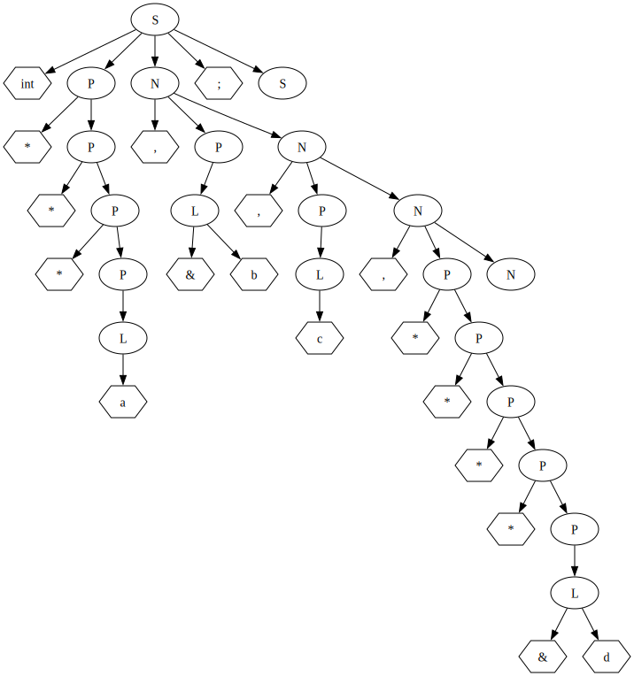

## Лабораторная работа №2.
Сентемов Лев M33351

### Вариант 7. Описание переменных в Си
Сначала следует имя типа, затем разделенные запятой имена переменных. Переменная может быть указателем, в этом случае перед ней идет звездочка (возможны и указатели на указатели, и т. д.). Описаний может быть несколько. Используйте один терминал для всех имен переменных и имен типов.
Пример: `int a, *b, ***c, d;`

#### 1. Разработка грамматики
```
S -> name P N ; S
S -> ; S
S -> eps
P -> * P
P -> name
N -> , P N
N -> eps
```
| Нетерминал | Описание                 |
|------------|--------------------------|
| S          | описание переменных      |
| P          | указатель или переменная |
| N          | следующая переменная     |
Нет левой рекурсии или правого ветвления

#### 2. Построение лексического анализатора
| Терминал               | Токен     |
|------------------------|-----------|
| *                      | POINTER   |
| [a-zA-Z_][a-zA-Z0-9_]* | NAME      |
| ,                      | COMMA     |
| ;                      | SEMICOLON |
| $                      | END       |

#### 3. Построение синтаксического анализатора
| Нетерминал | First      | Follow |
|------------|------------|--------|
| S          | name ; eps | $      |
| P          | name *     | ; ,    |
| N          | , eps      | ;      |

#### 4. Визуализация дерева разбора
`int a, *b, ***c, d;`



#### 5. Подготовка набора тестов
| Тест                            | Описание                         |
|---------------------------------|----------------------------------|
| int a;                          | одна переменная                  |
| float b, c, d;                  | несколько переменных             |
| double *e;                      | указатель                        |
| char ******f;                   | несколько указателей             |
| foo a, *b, ***c, d;             | всё вместе                       |
| bar*a,b,c,**d;                  | без пробелов                     |
| baz ** * **    **  f ;          | случайные пробелы                |
| int ***x<br/>, *<br/>*y,<br/>z; | несколько строк                  |
| int a;; float b;                | несколько описаний               |
|                                 | пустая строка                    |
| wrong                           | слово без ;                      |
| char;                           | только тип                       |
| int , g ;                       | без имени первой переменной      |
| long a,  , b;                   | без переменной в середине списка |
| double a, b, ;                  | без последней переменной         |
| string q, queue s;              | разные типы через запятую        |
| type ***;                       | без имени переменной             |
| a b c;                          |                                  |
| int 2abc;                       | неправильный формат имени        |
| * f;                            | без типа                         |
| , a, *b;                        | без типа и первой переменной     |
| long j *;                       | указатель не в том месте         |


#### 6. Модификация
Добавить &

Новая грамматика
```
S -> name P N ; S
S -> ; S
S -> eps
P -> * P
P -> L
L -> & name
L -> name
N -> , P N
N -> eps
```
| Нетерминал | First      | Follow |
|------------|------------|--------|
| S          | name ; eps | $      |
| P          | * & name   | , ;    |
| N          | , eps      | ;      |
| L          | & name     | , ;    |
